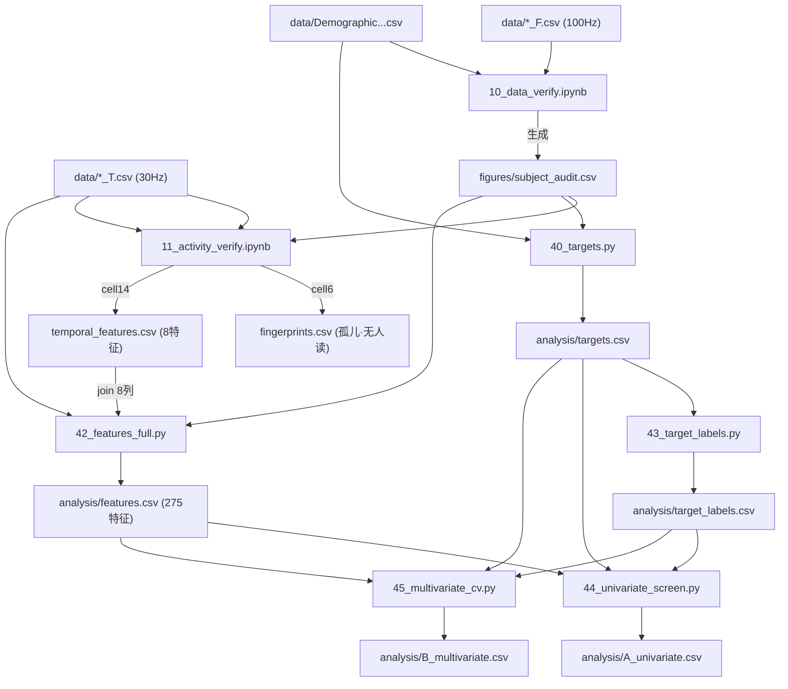

# INVENTORY.md — 项目文件清点与代码分层（只读产出）

> **相关文件**：文档体系说明 → [DOC_SYSTEM.md](DOC_SYSTEM.md)；追踪 → [working/issue.md](working/issue.md) · [working/task.md](working/task.md) · [working/backlog.md](working/backlog.md)。

> 本报告只读代码得出。**未读** `archive/PROBLEM_REGISTER.md`（遵约独立判断）。
> 已读（约定允许）：`FEATURE_MENU.md` / `MODEL_MENU.md` / `TARGET_MENU.md` 的存在被登记，但未据其结论下判断。
> 标注约定：〔实证〕= 从代码/数据直接读出；〔推测〕= 推断，可能错。
> 读入/写出路径均从代码里实际读出，非从文件名推断。
> **未完整读的文件**：`analysis/00_explore.ipynb`（28 个代码单元，仅扫描其 read_csv/glob 调用，未逐单元读全）；
> notebook `11_activity_verify.ipynb` / `10_data_verify.ipynb` 已用 json 提取全部代码单元逐一读过。
>
> **2026-07-25 · TASK-1 时间结构族重写(commit `5a9fbdf`)后的对账**:① `42_features_full.py` **已删掉对 `temporal_features.csv` 的 join**,时间结构两条路径(A 滑窗/B 逐样本)都在脚本内原生算、各扫 9 档百分位(A 各人阈值、B 合池阈值);② `features.csv` 现为 **351 特征**(旧 275);③ 删恒常数列 `jerk_median`、去重删 `mag_median`(留 `uaMag_median` 作负对照);④ 主链路**不再依赖 notebook**——`temporal_features.csv` 现仅 `verify_temporal_provenance.py`(PASS A)与 notebook 自身画图用。**以本条与下方各表格行为准;本文件个别 TASK-1 前的流程图/散文(如"第二部分/第四部分"里的 275 列、"42 读 temporal_features"、"两条路径应合并"等)未逐处回改,阅时以此对账。** 决策日志/勘误区(文末)属 append-only 历史,原样保留。

---

## 第一部分：文件清册

### 代码文件（.py / .ipynb）

| 文件 | 一句话作用 | 层 | 读入（实际路径） | 写出（实际路径） | 状态 |
|---|---|---|---|---|---|
| `analysis/00_explore.ipynb` | 最初摸数据：看单个 CSV 分隔符/列/activity 取值 | L0 探针 | `data/C10_F.csv`,`data/C10_T.csv`,`data/Demographic and mental health data.csv`,`glob data/*_T.csv` | 无 to_csv〔实证〕 | 废弃（一次性探索，无下游读取） |
| `analysis/10_data_verify.ipynb` | 数据质量审计：时长/采样率/重复文件/损坏表头/缺失 → 生成 24 人名单 | L1 数据层 | `data/*_F.csv`,`data/*_T.csv`,`data/Demographic and mental health data.csv` | `figures/subject_audit.csv`(cell15)；`figures/coverage_overview.png` | **活跃**（subject_audit.csv 是全链路上游）〔实证〕 |
| `analysis/11_activity_verify.ipynb` | 生成 placement 指纹 + 8 个时间结构特征 + 汇报图 | L1+L2 | `data/*_T.csv`,`subject_audit.csv`,`figures/subject_audit.csv`,`data/temporal_features.csv` | `fingerprints.csv`(cell6)；`temporal_features.csv`(cell14, cwd 根目录)；`data/temporal_features.csv`(cell16)；`figures/fig*.png` | **仅画图/探索**（其 `temporal_features()` 已被 TASK-1 迁入 42 原生实现；产物 `temporal_features.csv` 主链路不再读，仅 verify+本 notebook 画图用）〔实证〕 |
| `analysis/20_codebook_verify.py` | 从原始数据逐条验证 CODEBOOK（档数/BMI/SDQ映射/md5/传感器自证）| L0 探针 | `data/Demographic and mental health data.csv`,`data/H1_F.csv`,`data/H2_T.csv`,`data/{C28,Y54,Z5,Z14}_T.csv` | 仅 print | 活跃（验证脚本，随时复算）〔推测〕 |
| `analysis/21_rank_correlations.py` | SDQ 24 题两两相关排序（不分组不反向）| L0 探针 | `data/Demographic and mental health data.csv` | 仅 print | 废弃（探索性） |
| `analysis/22_cluster_items.py` | SDQ 24 题层次聚类（不预设分组）| L0 探针 | 同上 | 仅 print | 废弃 |
| `analysis/23_heatmap_subscales.py` | SDQ 子量表相关热图 | L0 探针 | 同上 | `savefig`(路径变量 out)〔实证〕 | 废弃|
| `analysis/24_heatmap_A_vs_B.py` | SDQ 列映射 A/B 假设对比热图 | L0 探针 | 同上 | `savefig`(out) | 废弃 |
| `analysis/25_explore_rank_corrected.py` | 反向题翻正后两两相关排序 | L0 探针 | 同上 | 仅 print | 废弃 |
| `analysis/26_explore_group_associations.py` | 子量表 5×5 平均相关矩阵 + 热图 | L0 探针 | 同上 | `savefig(FIG)` → `figures/sdq_group_association_5x5.png`〔推测〕 | 废弃 |
| `analysis/27_reverse_stored_test.py` | 判定 SDQ 反向题是"翻转前"还是"翻转后"存储 | L0 探针 | 同上 | `savefig` → `figures/reverse_items_stored_test.png`〔推测〕 | 活跃（回答了一个具体问题）〔推测〕 |
| `analysis/28_tscore_label.py` | 逐步算论文1 的 ADHD 标签（SNAP→Z→T≥55）；并证明减不减1不改标签 | L0 探针 | 同上 | 仅 print | 验证/说明脚本（T≥55 标签逐步演示；该逻辑已并入 43）〔实证〕 |
| `analysis/29_explore_id_letter.py` | 探索 ID 首字母编码了什么 | L0 探针 | 同上 | 仅 print | 废弃 |
| `analysis/30_paper1_table2_verify.py` | 逐行复算论文1 Table 2 | L0 探针 | 同上 | 仅 print | 活跃（验证脚本）〔推测〕 |
| `analysis/31_sensor_column_audit.py` | 传感器 CSV 逐列范围/样例审计 | L0 探针 | `data/H1_F.csv`,`data/H2_T.csv` | 仅 print | 疑似废弃（列审计，被 `20` 的传感器自证段覆盖且更严格）〔实证〕 |
| `analysis/32_motor_feature_probe.py` | 探查运动障碍类信号（震颤带/jerk/子动作）| L0 探针 | `data/*_F.csv`(前8) | 仅 print | 废弃（无金标准的死路） |
| `analysis/33_tremor_in_still_segments.py` | 静止段找窄震颤峰 | L0 探针 | `data/*_F.csv` | 仅 print | 废弃（同上，探索运动障碍） |
| `analysis/34_sdq_total_bands_verify.py` | 验证 SDQ 总困难分档是否来自本样本 | L0 探针 | `data/Demographic and mental health data.csv` | 仅 print | 活跃（验证脚本）〔推测〕 |
| `analysis/35_reproduce_papers.py` | 复现论文1/2 数字，裁决 1.67 阈值尺度（原 `30_reproduce_papers.py`，TASK-13 改名） | L0 探针 | `data/Demographic and mental health data.csv` | 仅 print | 活跃（验证脚本）〔推测〕 |
| `analysis/36_td_bands_local_vs_gao.py` | 验证 SDQ 总困难分档，对照 Gao 2013 国家常模（原 `34_td_bands_local_vs_gao.py`，TASK-13 改名） | L0 探针 | `data/Demographic and mental health data.csv` | 仅 print | 活跃（验证脚本）〔推测〕 |
| `analysis/40_targets.py` | 算 24 人所有候选目标 y（SNAP/SDQ 子量表+总，标准尺度）| L3 建模 | `data/Demographic and mental health data.csv`,`figures/subject_audit.csv` | `analysis/targets.csv` | **活跃**（主链路）〔实证〕 |
| `archive/41_features_min.py` | 最小特征管线（8 时间结构 + 4 时域，只为证链路通）| L2 特征 | `data/{s}_T.csv`,`figures/subject_audit.csv`,`temporal_features.csv`,`analysis/targets.csv` | `analysis/features.csv` | **归档**（链路通 smoke test；输出被 42 覆盖，不参与生产；D3 决定）〔实证〕 |
| `analysis/42_features_full.py` | 全量特征（12 通道 × 时域14/频域7 + 时间结构:路径A滑窗/路径B逐样本 各扫9档,均脚本内原生算,TASK-1 起删 join）| L2 特征 | `data/{s}_T.csv`,`figures/subject_audit.csv`,`analysis/targets.csv` | `analysis/features.csv` | **活跃**（当前 features.csv=352列[351特征+subject]由它产出）〔实证〕 |
| `analysis/43_target_labels.py` | 连续 y 切分组标签（分位数二/三/四分 + 常模T≥55）| L3 建模 | `analysis/targets.csv` | `analysis/target_labels.csv` | **活跃**〔实证〕 |
| `analysis/44_univariate_screen.py` | A 轨：单变量筛查（Spearman/AUC + 置换 + 留一 + BH-FDR）| L3 建模 | `analysis/features.csv`,`analysis/targets.csv`,`analysis/target_labels.csv` | `analysis/A_univariate.csv` | **活跃**〔实证〕 |
| `analysis/45_multivariate_cv.py` | B 轨：多变量 CV（Ridge/SVM/RF，留一，折内选特征 + 置换）| L3 建模 | `analysis/features.csv`,`analysis/targets.csv`,`analysis/target_labels.csv` | `analysis/B_multivariate.csv` | **活跃**〔实证〕 |
| `analysis/50_temporal_design_probes.py` | TASK-1 设计探针×2：①未截断 uaMag 自相关衰减尺度（给"平滑窗长该取几秒"一个数据锚点）②合池 vs 各人阈值 下结构特征与运动总量 uaMag_median 的秩相关（量化"合池的总量泄漏代价"）| L0 探针 | `data/{s}_T.csv`,`figures/subject_audit.csv`（未截断读全长；根目录可用 `ADHD_ROOT` 覆盖）| 仅 print（不写盘、不进 features.csv）| 活跃（TASK-1 决策支持；关联 ISSUE-101/102/115）〔实证〕 |
| `analysis/51_jerk_channel_audit.py` | jerk 通道 21 列逐列体检：四项判据（退化/单尖峰主导/求导噪声/求导频谱指纹），给"哪几列删/换/留"提供依据（TASK-1 决策7）| L0 探针 | `data/{s}_T.csv`,`figures/subject_audit.csv`（截断口径匹配 features.csv；`ADHD_ROOT` 可覆盖）| 仅 print（不写盘）| 活跃（TASK-1 决策支持；关联 ISSUE-104/110）〔实证〕 |
| `analysis/52_scan_compute_cost.py` | 成本探针×2：①滑窗扫描的算力与列数成本——直接调生产函数 `time_structure()` 对 ISSUE-115 裁定的 5 组窗配置计时，并推算特征表列数 351→571、记录"段时长分辨率=步长"这条耦合约束（供 TASK-108）②TASK-10 待补特征大类的算力可行性——DFA/排列熵/LZ/自相关直接实测，样本熵按 O(N²) 外推，RQA 算递归矩阵内存 | L0 探针 | `data/{s}_T.csv`,`figures/subject_audit.csv`,`analysis/features.csv`（截断口径匹配 features.csv；`ADHD_ROOT` 可覆盖）| 仅 print（不写盘、不进 features.csv）| 活跃（TASK-108/TASK-10 决策支持；关联 ISSUE-115）〔实证〕 |
| `analysis/53_stat_budget_probes.py` | 统计预算探针×2：①特征数增长对 BH-FDR 校正的代价——往现有 p 值里掺 K 个纯噪声特征重算 q，含"新增里有 1 个真信号"的反向情形（供 TASK-10/TASK-108/ISSUE-121）②n=24 的检验效能与置信区间——最小可测 rho、power、CI 宽度、达 80% power 所需样本量（供 ISSUE-116）| L0 探针 | `analysis/A_univariate.csv`（探针2 不读任何数据，纯统计公式；`ADHD_ROOT` 可覆盖）| 仅 print（不写盘）| 活跃（裁决时段决策支持）〔实证〕 |
| `consistency_explained.py`（根目录）| 教学版：逐行讲解 20_codebook_verify 的 SDQ 一致性段 | L0 探针 | `data/Demographic and mental health data.csv` | 仅 print | 废弃（教学副本，逻辑与 20 的 C4 段重复）|
| `.claude/hooks/protect_data.py` | PreToolUse 钩子：拦截对 data/ 的写操作 | 基础设施 | — | — | 活跃（保护 data/ 只读）〔推测〕 |

### 数据/文档文件（.csv / .md）

| 文件 | 一句话作用 | 层 | 谁写 | 谁读 | 状态 |
|---|---|---|---|---|---|
| `data/Demographic and mental health data.csv` | 原始临床问卷（58×55）| DATA | 原始下载 | 40 及所有 L0 探针 | 活跃（只读源）〔实证〕 |
| `data/*_T.csv`（约 33 个，~30Hz）| 原始腕表长记录（分号分隔，4 个表头损坏）| DATA | 原始下载 | 41/42/notebook10 | 活跃（特征输入）〔实证〕 |
| `data/*_F.csv`（约 50 个，~100Hz）| 原始腕表短记录（逗号分隔）| DATA | 原始下载 | 32/33 探针；notebook10 时长审计 | 部分活跃（主链路不用，见第五部分）〔实证〕 |
| `data/md5sums.txt` | 数据集自带哈希（佐证 2 对重复 _T）| DATA | 原始下载 | 无脚本读（人工/md5比对）〔实证〕 | 参考 |
| `figures/subject_audit.csv` | 24 人可用名单（status/usable/_T）| L1 产物 | notebook10_data_verify cell15 | 40/41/42/notebook11_activity | 活跃（全链路上游）〔实证〕 |
| `figures/subject_audit.pdf` | `subject_audit.csv` 的图片/PDF 版（给导师 pre 用）| DOC/产出 | 人工导出 | 无脚本读 | 产出（与其它图表同放 figures/）〔用户陈述〕 |
| `figures/*.png`（9 张）| 汇报图 | DOC | notebook10 / 脚本23/24/26/27 | 无脚本读（人看）| 最终产物〔推测〕 |
| `temporal_features.csv`（根目录）| 8 时间结构特征（win10s/step5s/pct50，30Hz）| L2 产物 | notebook11_activity cell14 | `verify_temporal_provenance.py`(PASS A) + notebook11 自身画图〔实证〕 | TASK-1 后**不再是主链路上游**（42 已删 join、原生算）；仅剩溯源校验+画图用〔实证〕 |
| `fingerprints.csv`（根目录）| 每人 placement 指纹（时长/fs/mag/rot/still）| L1 产物 | notebook11_activity cell6 | 无脚本读〔实证〕 | 孤儿（生成后无下游读取）〔实证〕 |
| `analysis/probe_outputs/*.md`（7 个）| 探针 50/51/52/53 的原样 stdout 快照，各带溯源头注（产出脚本·日期·脚本版本 commit·复现命令）。50/51 产：autocorr_timescale（自相关衰减尺度）/ pooling_leakage（合池总量泄漏）/ jerk_channel_audit（jerk 21 列体检）；52 产：scan_window_cost（滑窗扫描算力与列数）/ feature_class_feasibility（待补特征大类可行性）；53 产：fdr_family_growth（特征数增长的 FDR 代价）/ power_n24（n=24 效能与置信区间）| 结果快照 | 人工由 50/51/52/53 重跑覆盖 | 无脚本读（人看/追溯）| 活跃（TASK-1/TASK-108/TASK-10 决策留痕；勿手改，重跑脚本更新）〔实证〕 |
| `analysis/targets.csv` | 24 人 × 10 候选连续目标 | L3 产物 | 40 | 43/44/45 | 活跃〔实证〕 |
| `analysis/target_labels.csv` | 分组标签 | L3 产物 | 43 | 44/45 | 活跃〔实证〕 |
| `analysis/features.csv` | 24 人 × 351 特征（TASK-1 起；旧 275）| L2 产物 | **42**（当前）/41（被覆盖）| 44/45 | 活跃〔实证〕 |
| `analysis/A_univariate.csv` | A 轨结果（5775 行）| L3 产物 | 44 | 无脚本读 | 最终产物〔实证〕 |
| `analysis/B_multivariate.csv` | B 轨结果 | L3 产物 | 45 | 无脚本读 | 最终产物〔实证〕 |
| `analysis/chinese_norms.md` | 中国 SNAP/SDQ 常模文献搜集（为后续分组决策服务）| DOC/结果 | 人工搜集 | **无脚本读**（仅供人决策参考，未接进任何 label）| 结果〔实证〕 |
| `CODEBOOK.md`,`PAPER_DATA_USAGE.md`,`analysis/{FEATURE,MODEL,TARGET}_MENU.md`,`ref/SDQ_FINDINGS.md`,`literature/*.md` | 文档 | DOC | 人工 | 人看 | DOC〔实证〕 |

---

## 第二部分：依赖图

### 主链路（从原始数据到最终结果）

**从原始传感器数据到 features.csv 的完整路径〔实证〕**
1. `10_data_verify.ipynb` → `figures/subject_audit.csv`（定 24 人名单）
2. `11_activity_verify.ipynb` → `temporal_features.csv`（8 个时间结构特征，win10s/step5s/pct50，读 `_T.csv`）
3. `42_features_full.py` 读 `_T.csv` 现算 267 个特征 + join `temporal_features.csv` 的 8 列 → `analysis/features.csv`（275 特征）

**从 features.csv 到 A/B 的路径〔实证〕**
- `features.csv` + `targets.csv`(40) + `target_labels.csv`(43) → `44` → `A_univariate.csv`
- 同三输入 → `45` → `B_multivariate.csv`

**断链与隐性依赖〔实证〕**
- **隐性上游**：`42/41` 依赖 `temporal_features.csv`，而后者**只由 notebook 生成**（`11_activity_verify.ipynb`）。若从头重跑纯 .py，缺这个 notebook 步骤会断——`42` 会因 `read_csv(temporal_features.csv)` 报错。链路对 notebook 有硬依赖，非纯脚本可复现。
- **subject_audit.csv 双写**：`10_data_verify` 写 `figures/subject_audit.csv`；`11_activity_verify` cell14 又读**根目录** `subject_audit.csv`（cwd，可能不存在），cell15/16 读 `figures/subject_audit.csv`。同名文件两处路径，脆弱。〔实证〕
- **temporal_features.csv 三写**：`10_activity` cell14 写根目录、cell16 写 `data/`（原判"被 data/ 保护钩子拦截、会失败"——**⚠️更正：该判断有误，见勘误 2026-07-19·B4；hook 只拦 AI 工具、管不到用户自己的 notebook kernel，data/temporal_features.csv 不存在的真因未知**）；`41/42` 实际读的是**根目录**那个。
- **孤儿产物**：`fingerprints.csv` 生成后无任何脚本读取。〔实证〕
- 未见断链式"读一个不存在的文件"的静态引用（除上面 cwd 的 subject_audit.csv 相对路径隐患）。

---

## 第三部分：硬编码参数扫描【重点】

只扫 L2 代码：`42_features_full.py`（当前活跃）、`41_features_min.py`（被覆盖）、notebook `11_activity_verify.ipynb` 的 `temporal_features()`（其产物 join 进 features.csv）。

**总体结论〔实证〕：L2 特征代码基本是"采样率感知"的——凡涉及时间的地方都先 `/fs` 或 `*fs` 换算成物理量。真正的裸采样点常数极少。下表逐个判定。**

| 文件:行号 | 代码片段 | 数值 | 单位性质 | 30Hz→100Hz 是否需改 |
|---|---|---|---|---|
| `42:45` | `np.percentile(x,[75,25])` | 75/25 | 百分位（无量纲）| 否 |
| `42:72` | `bp_lf: band(0.5,3)` | 0.5,3 Hz | 物理（Hz）| 否（Hz 绝对，但见↓语义漂移）|
| `42:72` | `bp_mf: band(3,6)` | 3,6 Hz | 物理（Hz）| 否 |
| `42:72` | `bp_hf: band(6,nyq)` | 6 Hz, 上界=fs/2 | 物理（Hz）| **否但语义变**：nyq 从 15→50Hz，高频带从 6-15 变 6-50，含义静默改变（见第五部分）|
| `42:69` | `nyq=fs/2` | — | 由 fs 推导 | 自动随 fs 变（正确）|
| `42:94` | `np.mean(a<1.0)`，`a=act_len/fs` | 1.0 秒 | 物理（秒，已先 /fs）| 否（正确的 fs 感知写法）|
| `42:92` | `a=act_len/fs` | — | 样本→秒换算 | 自动（正确）|
| `42:89` | `n_switch/dur_min`，`dur_min=len(mag)/fs/60` | 60 | 物理（秒/分）| 否 |
| `42:111` | `jerk=np.diff(uaMag)*fs` | — | 导数（×fs）| 自动（正确）|
| `42:122` | `for pct in (50,75,90)` | 50/75/90 | 百分位（无量纲，样本内自适应阈值）| 否 |
| `42:83` | `thr=np.percentile(mag,thr_pct)` | — | 自适应阈值 | 否（无固定阈值）|
| `42:56-57`| `np.hanning(n)`,`rfft`，n=全长 | — | 全信号 FFT（无 nperseg）| 否（无固定窗长，但频率分辨率随 n 变）|
| `42:29/37`| `assert 0.9<g<1.1`（raw \|a\| 中位数）| 0.9,1.1 G | 物理（G，重力自检）| 否（对 _F 是否成立需实测，见第五部分）|
| **notebook `temporal_features()`** | | | | |
| cell12 | `win_s=10, step_s=5` | 10,5 秒 | 物理（秒）| 否（`win=int(win_s*fs)` 已 fs 感知）|
| cell12 | `win=int(win_s*fs)`,`step=int(step_s*fs)` | — | 秒→样本 | 自动（正确）|
| cell12 | `pct=50` | 50 | 百分位 | 否 |
| cell12 | `(act <= 10).mean()`，act=durs 秒 | 10 秒 | 物理（秒，durs=diff*step_s）| 否 |
| cell12 | `durs=np.diff(edges)*step_s` | — | 段长→秒 | 自动（正确）|
| **`41_features_min.py`（被覆盖，仅登记）** | | | | |
| 41:36 | `ua_zcr=zc/(len(x))` | — | 每样本过零率 | 否（无固定窗）|
| **L0 探针里的裸采样点常数（不进 features.csv，仅供参考）** | | | | |
| `32:21` | `nperseg=min(1024,len(mag))` | 1024 样本 | **采样点数** | 是（30Hz→34s 窗，100Hz→10s 窗，频率分辨率静默变）|
| `32:30` | `find_peaks(..., distance=int(fs*0.15))` | 0.15 秒 | 物理（秒×fs）| 否 |
| `32:30` | `height=np.std(mag)*0.5` | 0.5 | 相对（×std）| 否 |
| `33:32` | `nperseg=min(256,len(seg))` | 256 样本 | **采样点数** | 是（同上）|
| `33:11` | `win_s=4.0`,`w=int(win_s*fs)` | 4.0 秒 | 物理（秒）| 否 |
| `33:16` | `range(0,...,int(fs*0.5))` | 0.5 秒步 | 物理（秒）| 否 |
| `33:39` | `prom>8`,`rms<0.03` | 8, 0.03G | 判据阈值（经验）| 否（但跨率可比性存疑）|

**要点〔实证〕**：进入 `features.csv` 的 L2 代码里，**没有一个裸采样点常数**——窗长/步长/最短段长全部用"秒 × fs"表达。唯一会随 fs 静默改变语义的是频带上界 `band(6, nyq)`（Nyquist 依赖）。真正的裸采样点常数（`nperseg=1024/256`）只出现在**不进主链路的 L0 震颤探针**（32/33）里。

---

## 第四部分：重叠与冲突

### 41 vs 42 的关系〔实证〕
- 两者**写同一个文件** `analysis/features.csv`，是竞争写者。
- `41_features_min.py`：8 时间结构（join）+ 4 时域（mean/std/rms/zcr）= 12 列，注释自称"最小管线，只为证明链路通"。
- `42_features_full.py`：12 通道 × (时域14+频域7) + `uaMag` 上 3 阈值 × 5 时间结构 + join 8 列 = **275 列**。
- **当前 features.csv 有 276 列（275 特征+subject）→ 由 42 产出**〔实证〕。41 的产物已被覆盖 → 41 事实上废弃（保留作"链路通"的历史见证）。

### 编号碰撞与断层〔实证〕
- **编号碰撞已全部消除**（TASK-13，2026-07-22）〔实证〕：此前 `analysis/` 有四组数字前缀重复——两个 `10_`、两个 `30_`、两个 `31_`、两个 `34_`。处理方式与改名对照：

  | 改名前 | 改名后 | 同组保留原号的那个 |
  |---|---|---|
  | `10_activity_verify.ipynb` | `11_activity_verify.ipynb` | `10_data_verify.ipynb` |
  | `30_reproduce_papers.py` | `35_reproduce_papers.py` | `30_paper1_table2_verify.py` |
  | `31_chinese_norms.md` | `chinese_norms.md`（去掉数字前缀） | `31_sensor_column_audit.py` |
  | `34_td_bands_local_vs_gao.py` | `36_td_bands_local_vs_gao.py` | `34_sdq_total_bands_verify.py` |

  `10_` 组保留取舍依据：`10_data_verify.ipynb` 产出 `figures/subject_audit.csv`（24 人名单），被 `11_activity_verify.ipynb` 读取，是其上游，故保留较小号。`31_` 组：`31_chinese_norms.md` 是人工搜集的常模文献文档、无任何脚本读取，不属于按顺序执行的脚本序列，故去掉数字前缀。所有改名均用 `git mv`，文件内容零改动；这些文件互不 import，改名不改变任何运行结果。当前 `analysis/` 内数字前缀无重复。
- **断层**：20 之后 21-36 是一大片 SDQ/论文验证探针（L0），37-39 空缺，40 起才是建模主链路。〔推测〕反映：先花大量精力搞清"数据到底是什么"（问卷编码/尺度/论文口径），确认后才进入 40+ 的建模；21-36 多为一次性、跑完即弃的验证脚本。12-19 空缺（`11_` 之后直接跳到 `20_`）。

### 根目录散落文件〔实证〕
- **`temporal_features.csv`**：notebook `11_activity_verify` cell14 生成（8 时间结构特征）；**被 41/42 读**，是主链路真实上游。**活跃**。
- **`fingerprints.csv`**：notebook `11_activity_verify` cell6 生成（placement 指纹）；**无任何脚本读取**。**孤儿**。
- **`consistency_explained.py`**：教学副本，逻辑与 `20_codebook_verify.py` 的 C4/一致性段重复；无人读、不产文件。**孤儿**。

### features.csv 的列来自不止一条计算路径【重要】〔实证〕
是。features.csv 里的时间结构特征来自**两条独立、方法不同的计算路径**：

| 路径 | 来源 | 方法 | 产出列 |
|---|---|---|---|
| **路径 A** | notebook `temporal_features()`（join 进来）| 滑窗 10s/步5s → 窗均值在**中位数**二值化 → 段长以 step_s(5s) 计 | `switch_per_min, act_bout_median, stl_bout_median, act_bout_cv, stl_bout_cv, frac_act_short, within_win_sd, mag_median` |
| **路径 B** | `42` 的 `f_tstruct`（现算）| **逐样本** mag > 百分位(50/75/90) → 段长以样本/fs 计 | `actfrac_p{50,75,90}, switchmin_p{50,75,90}, actbout_med_p*, actbout_cv_p*, actshort_p*` |

两条路径在算**概念相同**的东西（切换率、爆发时长、短段占比），但方法不同（窗平滑 vs 逐样本；step 量化 vs fs 量化）。例如 `switch_per_min`(A) 与 `switchmin_p50`(B) 都是切换率，数值会不同。

**重复列（同一物理量两条路径产出）**〔实证〕：
- `mag_median`（路径 A）与 `uaMag_median`（42 通道时域）**数值完全相同**：相关=1.0000，最大绝对差 5e-5。二者都是 |userAccel| 的中位数。features.csv 里存了两遍。44/45 的负对照用的是 `mag_median`。

---

## 第五部分：我的判断

### 若重写特征计算部分〔实证+推测〕

**可原样保留**：
- `40_targets.py` / `43_target_labels.py`：目标与标签层，不涉及采样率，尺度换算（-1/反向）已核对清楚。保留。
- `44/45`：建模评估层，对特征表列名不敏感（列驱动），重写特征后无需改。保留。
- `42` 的 `load_T`（表头修复 + 重力自检）逻辑本身健壮，可复用其骨架。

**必须重写/整合**：
- **特征的两条时间结构路径应合并为一条**：现在 A（notebook）和 B（42）并存，方法不一致且有重复列（mag_median=uaMag_median）。重写时应删掉对 `temporal_features.csv` 的 join，把路径 A 的 8 个特征用统一方法在 42 内重算，消除 notebook 硬依赖。
- **把 notebook `11_activity_verify` 里的 `temporal_features()` 迁进 .py**：目前主链路对 notebook 有硬依赖（`temporal_features.csv` 只有 notebook 能生成），不可纯脚本复现。理由：可复现性。
- `41_features_min.py`：产物已被 42 覆盖，可删或明确归档。

### 从 30Hz 换到 100Hz 时会【静默出错】的地方〔实证+推测〕

（"静默"= 不报错、跑得通、结果错或不可比）

1. **表头位置移植会错位**〔实证 + 推测〕。`load_T` 用 `H45_T.csv`（30Hz，58 列）作 `REF_HEADER`，对损坏文件**按列位置**移植列名（`42:29-31`）。若改读 `_F.csv`（100Hz，逗号分隔），一旦其表头进入"损坏"分支，会把 30Hz 参考表头**按位置硬贴到 _F 的列上**——列可能对不齐却不报错，下游全部算错。这是最危险的静默点。

2. **频带 `band(6, nyq)` 语义静默漂移**〔实证〕。`bp_hf` 上界=Nyquist：30Hz 时是 6-15Hz，100Hz 时变 6-50Hz。同名特征在两套数据里**含义不同**，直接混用/比较会得出错误结论，但代码不报错。`bp_lf/bp_mf`（0.5-3、3-6Hz）绝对边界不变，相对安全。

3. **震颤探针 `nperseg=1024/256` 是裸采样点**〔实证〕（`32:21`,`33:32`）。30Hz 下 1024 样本≈34s，100Hz 下≈10s——频率分辨率与所测频带静默改变。这两个是 L0 探针不进主链路，但若被复用需改成 `int(秒*fs)`。

4. **重力自检阈值 `0.9<g<1.1` 对 _F 是否成立未验证**〔推测〕。若 _F 的重力列尺度/融合方式不同，assert 可能误触发（这会**报错**，属显性）；但若恰好落在带内却物理含义不同，则静默。

5. **cohort 静默改变**〔实证〕。24 人名单由 `subject_audit.csv` 的 `_T=='yes'` 决定。改用 _F 数据时，可用文件集合不同（50 个 _F vs 33 个 _T，重复/短记录/损坏名单也不同），若不同步更新 audit，样本构成会静默改变。

6. **全信号 FFT 频率分辨率随 n 变**〔实证〕。`42` 的 `f_freq` 对整段做 `rfft`（无 nperseg）。100Hz 下同样时长样本数增至 ~3.3 倍，频率 bin 更密——`domfreq/centroid/spread/entropy` 的数值基础改变，跨率不可比（不报错）。

**注**：需显式修改（非静默）的是 `41:44` / `42:106` 的 `DATA/f"{s}_T.csv"` —— 换 100Hz 要改成 `_F`，这是硬编码文件后缀，会明显暴露，不算静默。

---

*清点结束。事实以〔实证〕为准；带〔推测〕的状态判断（尤其"疑似废弃/孤儿"）建议结合你的记忆二次确认。*

---

## 勘误记录

- **2026-07-19 · 第二部分依赖图 · 删除边 `CLIN --> P42`**
  经 `grep -in "read_csv\|Demographic" analysis/42_features_full.py` 核实：`42_features_full.py` **不读** `data/Demographic and mental health data.csv`。其 read_csv 仅：`H45_T.csv`(表头参考)、逐人 `_T.csv`、`figures/subject_audit.csv`、`temporal_features.csv`、`analysis/targets.csv`。
  原图画了 `CLIN --> P42` 一条直连边，属**错误**，已删除。
  错误性质：42 在**末尾对齐自检**里读了 `targets.csv`（`42:136`，读的是 40 写盘后的产物），我把这条"写盘后的诊断读取"误当成了上游数据依赖，进而错误地把临床源 CLIN 直接连到 42。实际上临床数据只经由 `40 → targets.csv` **间接**到达 42，且仅用于验证，不参与特征计算。
  （注：第一部分清册中 42 的"读入"列本就未列 Demographic，与此更正一致；错误只在依赖图。）

- **2026-07-19 · temporal_features / subject_audit 溯源核查（命令行取证）**

  **已解决**

  1. 根目录 `subject_audit.csv` 原本不存在，`cell 14` 的 `pd.read_csv('subject_audit.csv')` 按当时状态必断。
     根因已确认：用户曾把该文件从根目录移入 `figures/`。
     _证据来源：用户陈述（非文件系统）。_
     （现状已被用户手动改变，见第 7 条。）
  2. `data/temporal_features.csv` **不存在**；因此 notebook 内部的画图链 `cell 16`(写 data/) → `cell 18`(读 data/) **现已整体断裂**（写被 data/ 只读钩子拦、读取不到）。 ⚠️**更正见 2026-07-19·B4：hook 拦不到 notebook，"写被钩子拦"是错的；文件不存在真因未知。断裂结论仍成立（读取不到 cell18 确会断），但原因不是 hook。**
     _证据来源：`md5 data/temporal_features.csv` 报 No such file；`grep -o` 显示 cell 18 为 `pd.read_csv(DATA / 'temporal_features.csv')`。_
  3. 存活的唯一数据源是**根目录** `temporal_features.csv`（md5 `c51fe8b14499f4852e6637d4e00cfebd`），由 `cell 14` 生成，被 `41/42` 消费。
     _证据来源：`md5 temporal_features.csv`；`grep temporal_features analysis/41_features_min.py analysis/42_features_full.py`（41 号脚本已于 TASK-3 移至 `archive/41_features_min.py`，命令为当时原文）。_

  **仍 OPEN**

  5. 该文件生成时的**代码版本未知**，与当前 `temporal_features()`（`win_s=10, step_s=5, pct=50`）是否一致**未验证**。这是 `features.csv` 中那 8 列（`switch_per_min` 等，路径 A）的溯源风险。
     验证方法：重算后做**列级数值比对**（非 md5——重跑的浮点/舍入/列序差异会让 md5 失配，但数值可等价）。
     _证据来源：推断（现存产物无内嵌版本戳）。_
  6. `cell 14` 与 `cell 16` 之间的 `cell 15` 是否修改过 `feat` **未查证**。若修改过，两份产物内容不同，且 .py 管线读的是**修改前**（cell 14）版本。
     _证据来源：尚未核查（待办）。_

  **更新 · #5 #6 已解决（A1/A2 验证，2026-07-19；上方原始疑问保留不删）**

  - **#5 → 已解决**：现存 `temporal_features.csv` **由当前版本的 `temporal_features()` 生成**。
    验证脚本 `analysis/verify_temporal_provenance.py` 用当前代码在 24 人上重算、与现存 csv 逐列比对：
    10 列（switch_per_min…n_bouts）**全部 max|Δ|=0，24 人无一不一致**。
    故 mtime 那 8.5h 窗口内 notebook 即便被保存过，也未改动影响本 csv 输出的代码；路径 A 那 8 列溯源风险**排除**。
    （原先"把 #5 证据升级为 mtime"的计划 B3 因此作废——A1 是比 mtime 更强的直接证据。）
    _证据来源：`verify_temporal_provenance.py` 原始输出（逐列 0 差异）。_
  - **#6 → 已解决**：`cell 15` **不修改** `feat`——它只断言并从 `figures/subject_audit.csv` 重取 24 人名单
    （`assert len(SUBJ_T)==24`），不引用/不改动 `feat`。`cell 14` 与 `cell 16` 各自独立用同一
    `temporal_features()` + 同一 24 人算出 `feat`，两次写盘内容一致（仅路径不同：根目录 vs data/）。
    _证据来源：notebook cell14/15/16 源码（json 提取通读）。_

  **用户在清点后手动创建的文件（非管线产物，下次清点勿误判）**

  7. 根目录 `subject_audit.csv` —— 从 `figures/subject_audit.csv` `cp` 而来，为让 `cell 14` 可跑。
     _证据来源：用户执行 `cp figures/subject_audit.csv ./subject_audit.csv`。_
  8. 根目录 `temporal_features.BACKUP.csv` —— 现存产物 `temporal_features.csv` 的备份，供重跑后比对用。
     _证据来源：用户执行 `cp temporal_features.csv temporal_features.BACKUP.csv`。_

- **2026-07-19 · 目标/标签层真实数据核查（第 4 点）**

  grep 全项目 + dump `targets.csv`/`target_labels.csv` 实际列 + 读 `43`，核实"每个地方代码真实用了什么"：
  - **连续回归目标**（`targets.csv`，`40` 生成）：10 列，标准计分（-1 / SDQ 反向 3-d），**无任何常模切点**。
  - **分组标签**（`target_labels.csv`，`43` 生成）：**39 列** —— 30 列样本内分位（qbin/qter/qquar，覆盖 10 个连续目标各 3 种切法）+ 6 列 `*__cn2013band3`（大陆 22,108 人家长版 SDQ 常模三分档，TASK-9 落地）+ 3 列症状计数（`snap_inatt__dsm_count7`、`snap_hyper__dsm_count7`、`snap_odd__dsm_count5`，Huang 2023 口径）。切点全部由 `analysis/labels/rules.yaml` 声明，`43` 代码里没有任何切点数字。
    _本行 2026-07-25 按 TASK-109 改写；被改写的原文是 2026-07-19 的现状快照（原文可在本文件 git 历史中取回，另在 `working/backlog.md` §「历史补记」处按历史记录原样保留）。原文写的是"30 列样本内分位 + **仅 1 列**常模锚定"，两处都已不成立：（1）**"常模锚定"这个说法本身是错的**——当时那一列的 mean/sd 取自这 24 个孩子自己、不是任何人群常模，TASK-8 决定2 已就此改名并纠正表述；真正落地的常模锚定是上面 6 列 `cn2013band3`。（2）那一列及其上游列（SNAP 全部 26 题之和，含第 19–26 题的对立违抗 ODD，故是"ADHD+ODD"混合量）已被删除，改用 `snap_adhd_total`（SNAP 第 1–18 题，0–54）——裁决见 `working/issue.md` 的 ISSUE-116，执行见 `working/task.md` 的 TASK-109。_
  - **唯一硬编进 label 的常模切点是 T≥55**（`43:34-35`，论文1 口径，在 24 人内重算）。
  - **中国常模三分组（adhd/高疑似/无 adhd）未在任何代码实现**；`chinese_norms.md` **无脚本读取**，停在文档层。
  - `sdq_hyper__norm8`（≥8 异常线）因本样本 0/24 退化，`43:41-43` 明确**不生成**，仅记一条 log。
  _证据来源：`grep -niE ... analysis/*.py`；`head targets.csv/target_labels.csv`；读 `43_target_labels.py`。_
  **待用户拍板（非本工具决定）**：(a) T≥55 是否从硬编改为可配置/可关；(b) 中国常模三分组是否落地实现。

  _2026-07-25 时效补注（执行 TASK-109 时顺带实测；本块其余各行按历史快照原样保留，只在此说明哪几行已被后续动作取代，不改原文）：_
  _· 上面第 3 行"唯一硬编进 label 的常模切点是 T≥55（`43:34-35`）"——已不成立两次：TASK-8 把 `43_target_labels.py` 改成读 `analysis/labels/rules.yaml` 的规则表驱动，代码里不再有任何切点数字；该 T≥55 规则本身又由 ISSUE-116 裁定整条删除（执行：TASK-109）。行号 `43:34-35`、`43:41-43` 指的是改造前的旧脚本，与现文件对不上。_
  _· 上面第 4 行"中国常模三分组未在任何代码实现、`chinese_norms.md` 无脚本读取"——已由 TASK-9 落地，现为 6 列 `*__cn2013band3`（切点存在 `analysis/labels/norms.csv`，出处存在 `analysis/labels/sources.csv` 的 `cn_sdq_parent_2013` 行）。_
  _· 因此上面"待用户拍板"的 (a)(b) 两问均已有裁决，不再悬空：(a) 走 ISSUE-6 → TASK-8（改为规则表驱动）后由 ISSUE-116 裁定删除；(b) 走 ISSUE-7 → TASK-9 落地。_

- **2026-07-19 · B4 更正：cell16 写 data/ "会失败" 的原因判断错误**

  原先在「第二部分·断链」与本勘误 #2 里说 `cell 16` 写 `data/temporal_features.csv` "被 data/ 保护钩子拦截、会失败"。**这个因果是错的**（原表述已保留、仅标注更正）。
  读 `.claude/hooks/protect_data.py` 证实：该 hook 是 Claude Code 的 PreToolUse guard，**只拦截 AI（我）的 Write/Edit/NotebookEdit 与 Bash 命令**；其 docstring 第 8-10 行明写 "CANNOT catch a program that writes to data/ internally (e.g. python -c open('data/x','w'))"。
  用户在**自己的 Jupyter kernel** 里跑 `feat.to_csv(DATA/...)` 完全在 hook 管辖之外——hook 对它**零影响**。
  故 `data/temporal_features.csv` 不存在的**真实原因未知**（最可能：cell 16 从未执行，或曾生成后被删/移），**不是** hook 拦截；md5 报 No such file 只证"现在不存在"、不证原因。
  订正后仍成立的结论：cell18 读 data/ 版会因文件缺失而断——但**断因是"文件不在"，非"钩子拦写"**。
  _证据来源：读 `.claude/hooks/protect_data.py`（docstring + tool_name 分支代码）。_
