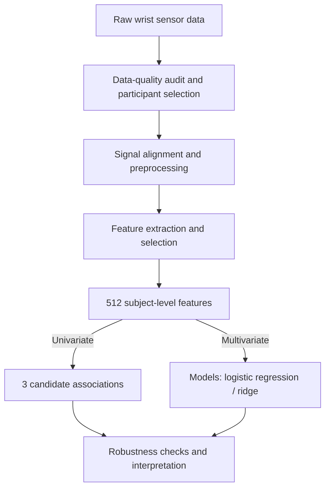

# Wrist accelerometry and ADHD questionnaire scores in 24 children

Research code for an exploratory question: **do features computed from a wrist-worn
accelerometer relate to parent-reported ADHD symptom scores?** The data are a public
dataset of 58 Chinese children (Apple Watch recordings + SNAP-IV and SDQ questionnaires);
24 children have both a usable task-state recording and complete questionnaires, and those
24 are the analysed cohort.

This is a working research repository, not a library. The scripts are numbered by pipeline
stage and every result table they produce is committed, so the analysis can be re-read — and
most of it re-run — without the raw recordings. The short answer the analysis reached, quoted
from `outputs/RESULTS_ANALYSIS.md`:

> These results do not establish a relationship between wrist-worn accelerometer features
> and questionnaire symptom scores in this cohort of 24 children.

Two feature–target pairs do survive multiple-comparison correction; the same document
explains why, at n = 24, that is a lead rather than a finding.

## Data

| | |
|---|---|
| Dataset | *Movement and Mental Health in Children* (Lin Wang), Zenodo DOI [10.5281/zenodo.14875672](https://doi.org/10.5281/zenodo.14875672) |
| Device | Apple Watch Series 7 running SensorLog v5.2 |
| Sensor files | 50 free-living files (`*_F.csv`, ≈100 Hz, ≈1 min) and 33 task-state files (`*_T.csv`, ≈30 Hz, ≈40–60 min), 58 columns each |
| Clinical table | 58 rows: sex, height, weight, BMI, 24 SDQ items (item 19 absent), 26 SNAP-IV items |
| Diagnosis label | **None.** Every ADHD-related target is derived from questionnaire scores |
| Analysed cohort | 24 children = usable task-state recording ∧ both questionnaires complete (`figures/subject_audit.csv` lists all 58 with the exclusion reason) |

The raw files (≈2.7 GB) are **not** in this repository. Download them from the Zenodo record
into `data/` to run the data-dependent stages. `CODEBOOK.md` is the data dictionary written
for this project — every column definition and every quirk found in the files (duplicate
recordings, an ID mismatch, an out-of-range item, corrupted headers), each traced back to the
raw data and re-checkable with `analysis/20_codebook_verify.py`.

Two published papers use the same dataset (Wang, *Sensors* 2025, 25(20):6459; Zhang, Liu &
Wu, *Biosensors* 2026, 16(6):323). Their published numbers were reproduced digit-for-digit
from these files as part of the codebook work (`analysis/30_*.py`, `analysis/35_*.py`).
Note that this project scores items on the instruments' standard 0-based scales, so its
target values are not directly comparable to the papers' as-stored 1-based numbers.

## Method overview



## What the pipeline does

**Phase 1 — from recordings to a screen**

1. **Targets** (`40_targets.py`): 10 continuous symptom scores per child — SNAP-IV
   inattention / hyperactivity-impulsivity / oppositional-defiant / ADHD total, and SDQ
   hyperactivity / emotional / conduct / peer / prosocial / total difficulties.
2. **Features** (`42_features_full.py`): 608 columns from the task-state recording,
   truncated to equal length across children — 251 channel statistics (21 time- and
   frequency-domain statistics on 12 channels), 320 time-structure columns describing how activity is
   organised into bouts, 36 nonlinear/complexity measures, and recording duration.
3. **Labels** (`43_target_labels.py`): binary/tertile/quartile splits and norm-band groups,
   driven by a rule table (`analysis/labels/`) so that no cut-point lives in code.
4. **Track A — univariate screen** (`44_univariate_screen.py`): every feature against every
   target, one at a time: Spearman ρ or rank-AUC, 100,000-permutation p-values, BH-FDR
   within each target, leave-one-out R². 12,160 tests.
5. **Track B — cross-validated models** (`45_multivariate_cv.py`): logistic regression /
   linear SVM / random forest (or ridge / SVR / RF for regression) with feature selection
   inside every fold of leave-one-out, permutation-tested against a dummy baseline.
6. **Read-out** (`60_`–`66_`): the figures and tables under `outputs/`, narrated in
   `outputs/RESULTS_ANALYSIS.md`.

**Phase 2 — feature reduction and a delivered model per target**

7. Redundancy reduction of the 608 columns to 512 by |Spearman| dedup
   (`70_`–`70c_`, decisions recorded in the scripts' headers).
8. K-grid screens — F-test and mutual-information selectors × three classifiers × K = 1…512
   (`71_`–`71d_`), a regression twin (`73_`), and a nested sequential-forward-selection
   comparison (`72_`).
9. **Final delivery** (`74_final_clf.py`, `74a_final_reg.py`): for each of 24 classification
   targets and 10 regression targets, a nested procedure (outer leave-one-out, inner
   leave-one-out choosing K ∈ 1…20 by log-loss) around a locked model — logistic regression
   for classification, ridge for regression — then a full-sample refit saved to
   `outputs/models/`. Metrics, chosen features and per-fold choices are in
   `analysis/final_*.csv`; figures in `outputs/figures/final_*.png`.

`analysis/README.md` maps every numbered script to its stage, inputs and outputs.

## Headline results

From `outputs/RESULTS_ANALYSIS.md` (phase 1) and `analysis/probe_outputs/final_*.md` (phase 2):

<br> **univariate**
- **The univariate screen behaves like noise in aggregate**: 604 of 12,160 cells reach raw
  p < 0.05 where 608 are expected by chance; median leave-one-out R² is −0.056.
- **Three cells survive FDR**, which are two findings (`snap_inatt` and `snap_adhd_total`
  correlate at ρ = 0.96): the fraction of short activity bouts (`frac_act_short_w10_p20`)
  with SNAP-IV inattention / ADHD total (ρ ≈ +0.77), and median activity-bout length
  (`act_bout_median_w0.5_p80`) with SDQ emotional symptoms (ρ = +0.77). Both are
  independent of total movement, robust to leaving any one child out, and were selected as
  the maximum of 12,160 comparisons — the data that selected them cannot also test them.

<br> **multivariate**
- **4 of 10 target beat the baseline.** The clearest is emotional: error drops ~0.5 point on a 0-10 scale, explaining roughly half of variance using just two features. 

- **Consistency evidence:** sdq_emo appears on both sides, meaning  the classification and regression analyses — two completely independent evaluation frameworks — identified the same set of targets. (Fig. 3&4)

- **The size of K related to whether a target contains real signal:**
  - Targets with clear signal K ≤ 5. The predictive information is concentrated in only one or two features (preliminary observation). 
  - large K values mostly occur for poorly performing targets. The inner loop cannot find a stable anchor in the noise and therefore keeps selecting more features. 


## Repository layout

```
.
├── README.md                    this file
├── LICENSE                      MIT
├── CODEBOOK.md                  data dictionary — every claim traced to the raw files
├── requirements.txt             pinned Python dependencies (Python 3.9.6)
├── analysis/                    the pipeline: numbered scripts + every committed result table
│   ├── README.md                script map: stage → script → inputs → outputs
│   ├── 00–11_*.ipynb            first look at the data
│   ├── 20–36_*.py               codebook verification, questionnaire scoring, paper reproduction
│   ├── 40–48_*.py               targets, features, labels, track A, track B
│   ├── 50–58_*.py               design and statistical-budget probes
│   ├── 60–66_*.py               phase-1 read-out (figures and tables under outputs/)
│   ├── 70–74e_*.py              phase 2: feature reduction, K-grid screens, final models
│   ├── *.csv                    committed tables: features, targets, labels, A/B results, phase-2 results
│   ├── *_MENU.md                human-readable decoding of features, targets and models
│   ├── labels/                  rule table, norm bands and citations behind every label
│   └── probe_outputs/           verbatim stdout snapshots of probes and phase-2 scripts
├── outputs/
│   ├── RESULTS_ANALYSIS.md      narrative read-out of phase 1
│   ├── figures/                 fig01–fig18 and the phase-2 figures (from 60_–74e_)
│   ├── tables/                  stdout snapshots of 60_–66_
│   ├── models/                  34 serialised final models (joblib), from 74_ / 74a_
│   └── understand_results/      hand-run notebooks and figures from the results walkthrough
├── figures/                     data-audit figures and subject_audit.csv (the cohort table)
└── docs/
    └── ref/                     SDQ scoring notes and reference documents
```

Not in the repository: `data/` (the raw recordings, ≈2.7 GB — download from Zenodo) and
`.venv/`. Comments and docstrings are partly in Chinese; the result documents and figure
captions are in English.

## Reproducing

Python 3.9.6 with the pinned dependencies:

```
python3 -m venv .venv
.venv/bin/pip install -r requirements.txt
```

**Runs from the committed tables (no raw data needed):** label generation (`43`), the
univariate screen (`44`), the phase-1 read-out (`60`–`66`), and the whole of phase 2
(`70`–`74e`). For example:

```
.venv/bin/python analysis/61_univariate_analysis.py    # track A read-out, ~15 s
.venv/bin/python analysis/62_multivariate_analysis.py  # track B read-out, ~5 s
.venv/bin/python analysis/74_final_clf.py              # classification delivery, <1 min
.venv/bin/python analysis/74a_final_reg.py             # regression delivery, <1 min
```

**Needs `data/`:** targets (`40`), feature extraction (`42`), the audit notebooks and the
codebook/paper-reproduction scripts (`00`–`36`), and the design probes (`46`, `50`–`57`).
Track B (`45`) needs `data/` only for its two exploratory BMI arms.

**Runtimes on record:** track A with 100,000 permutations ≈ 1 min; track B's production run
≈ 14.5 h (5,000 permutations per tested combination).

Some early exploration scripts (`21`–`36`, `46`) still hard-code the original checkout path
and will need that one line changed to run elsewhere; the pipeline scripts resolve paths
relative to their own location.

## Limitations

- n = 24, 512 features: enough resolution to rule out a large, broad movement signal, not
  enough to settle whether the two surviving cells are real. Replication needs a held-out
  cohort or a pre-registered test of those two pairs.
- No clinical ADHD diagnosis exists in the data; every target is a questionnaire score.
- Model hyper-parameters are fixed defaults, not tuned.
- Recording duration (41–60 min) is an uncontrolled confound in the multivariate track;
  the univariate survivors hold after partialling it out.
- One of the two surviving features takes only four distinct values across the 24 children.
- Track A and track B use different permutation tail conventions; §6 of
  `outputs/RESULTS_ANALYSIS.md` records the consequences.

## License

Code: [MIT](LICENSE). Data: not redistributed here — see the Zenodo record for the dataset's own terms.
