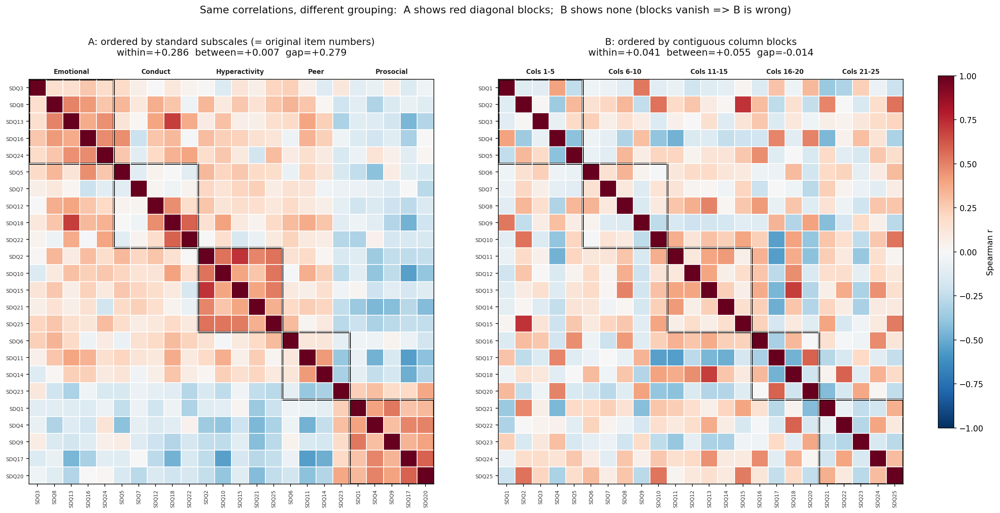
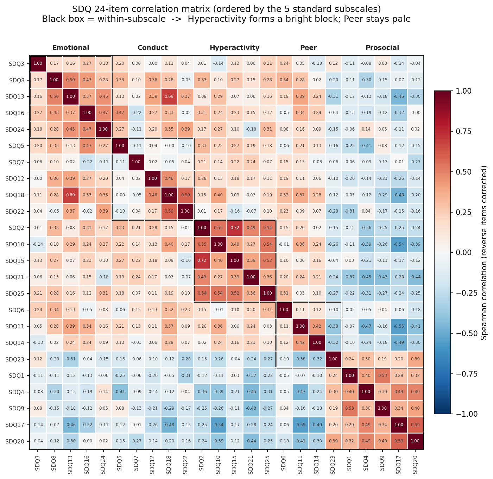
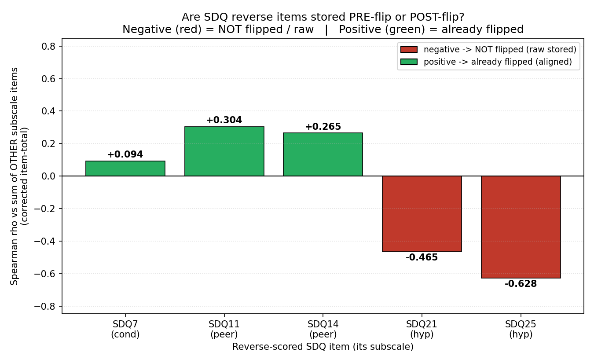
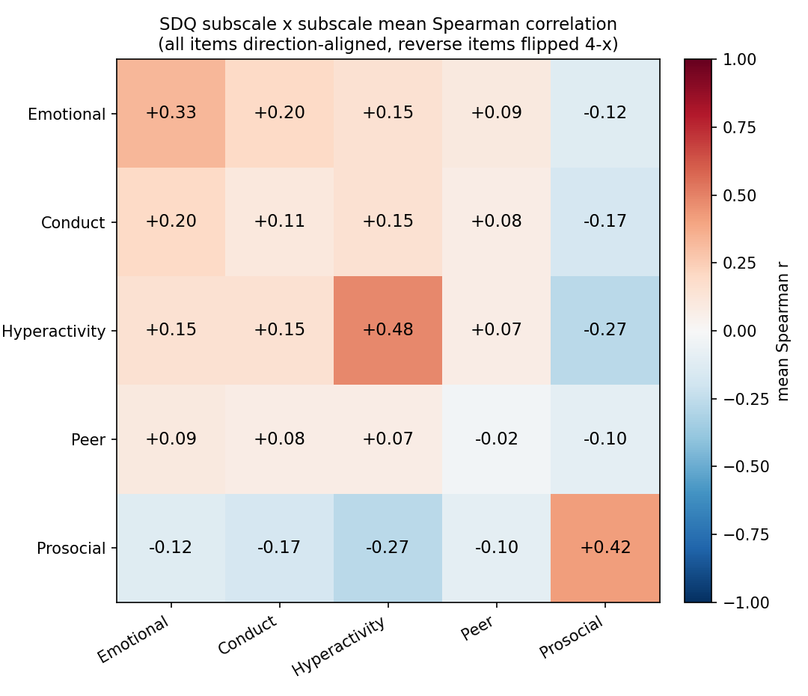

# SDQ 结论汇总 — 我们对这份数据 SDQ 表格得出的全部结论

> 本文件只讲 **SDQ**(临床表里 `SDQ1`–`SDQ25` 那些列)。数据来自 Zenodo `14875672`(简体中文家长版 SDQ)。
> 方法纪律:每条结论都从**原始数据 + 客观事实**推出,不采信二级结论(week2.pptx / notebook / 论文正文口径)。
> 依据分层:`实证`(数据直接观测)/ `自证`(列间恒等式/档数强制)/ `复现`(复现论文数字)/ `文献`(量表固有属性)。置信度:`已确证` / `不可靠` / `未解决`。
> 复算脚本:`analysis/25_explore_rank_corrected.py`、`analysis/26_explore_group_associations.py`、`analysis/27_reverse_stored_test.py`,以及 `20_codebook_verify.py` 的 C2/C4 段。

---

## 1. 列与编码

| 结论 | 依据 | 置信度 |
|---|---|---|
| SDQ 列 = `SDQ1`–`SDQ18`, `SDQ20`–`SDQ25`,共 **24 题,缺 `SDQ19`** | 实证 | 已确证 |
| 取值集合 = **{1, 2, 3}**;SDQ 仪器客观上 3 个作答档(0/1/2)⇒ **数据是 1-indexed,标准分 = 数据 − 1** | 实证 + 仪器 | 已确证 |
| 越界异常:**S32 的 SDQ8 = 13**(任何 SDQ 编码下都非法) | 实证 | 已确证 |
| 缺失是"全有或全无":约 **8–9 名受试者整套 SDQ 缺失**(其余各人 24 题基本齐全) | 实证 | 已确证 |
| 缺失的 **SDQ19 = "被别的孩子欺负/取笑"**(peer 子量表) | 仪器(问卷题序) | 已确证 |

---

## 2. 列映射:列号 = 问卷**原始题号**(不是按子量表分块)

存在两个互斥假设:**A** = 列沿用问卷原始题号;**B** = 数据按子量表分块重排(week2 曾称 "hyperactivity = SDQ11–15")。四条客观证据一致判 **A**:

| 证据 | A(原始题号) | B(分块) |
|---|---|---|
| 缺号结构 | 缺号恰在 19、保留 20–25 跳号 ⇒ 保留原始题号 | 分块应连续无跳号 ✗ |
| 组内 vs 组间平均相关 | within **+0.286** / between +0.007 | within +0.041 / between +0.055 ✗ |
| 逐题"最近子量表"命中 | **13/24** | 5/24 ✗ |
| 与 SNAP 的收敛效度 | ρ = **+0.574** | +0.305 |

**同一批相关值、只换分组:A 出现红块,B 块结构消失** —— 直观证据:

逐题(24×24,方向对齐、按子量表排序)全貌:

> **裁决**:hyperactivity = **SDQ2, 10, 15, 21\*, 25\***(`*`=反向),**不是** SDQ11–15。week2 slide6 的 "SDQ11–15" 说法被否;`00_explore.ipynb` 用的恰是正确的一组。【依据:数据结构 + 组间判别 + 跨仪器收敛效度。已确证】

**五个子量表的题号**(`*`=反向,1–3 编码下反向 = `4−x`):

| 子量表 | 题号(=列名) |
|---|---|
| Emotional 情绪 | SDQ3, 8, 13, 16, 24 |
| Conduct 品行 | SDQ5, 7*, 12, 18, 22 |
| **Hyperactivity 多动** | **SDQ2, 10, 15, 21\*, 25\*** |
| Peer 同伴 | SDQ6, 11*, 14*, ~~19~~(缺), 23 |
| Prosocial 亲社会 | SDQ1, 4, 9, 17, 20 |

---

## 3. 反向题:数据存的是"翻转前"还是"翻转后"?

标准 SDQ 有 5 道反向题 {7, 11, 14, 21, 25}。用**未翻转**的原始数据,算每道反向题与本组其余题之和的相关:负=未翻转(原始),正=已翻转。

| 反向题 | ρ vs 本组其余题 | 翻转前后 α 变化 | 判定 | 置信度 |
|---|---|---|---|---|
| **SDQ25 (hyp)** | **−0.628** | hyp: −0.26 → **0.82**(翻后才自洽) | **未翻转(原始)** | 已确证 |
| **SDQ21 (hyp)** | **−0.465** | 同上 | **未翻转(原始)** | 已确证 |
| SDQ11 (peer) | +0.304 | peer: 0.47 → −0.29 | 疑似已翻转 | **不可靠** |
| SDQ14 (peer) | +0.265 | 同上 | 疑似已翻转 | **不可靠** |
| SDQ7 (cond) | +0.094 (p=0.52) | — | 无信号 | **不可靠** |

> **采纳的结论(已敲定)**:**整份数据的 SDQ 反向题都是"原始未翻"存储 —— 计分时必须对全部 5 道反向题 {7, 11, 14, 21, 25} 做 `4−x`。**
>
> 依据:①同一个实验 / 同一条数据处理管线只会用**一种一致的约定**,不可能只翻一部分反向题;②唯一**可靠**的信号(hyperactivity 的 21、25)明确指向"原始未翻"(item-total 强负 −0.47/−0.63、翻后 α 从 −0.26 跳到 0.82、翻后与 SNAP 收敛效度 0.574);③peer(11、14)、cond(7)那点相反的微弱信号,来自**本身就不成立的子量表**(peer α=−0.29、SDQ7 p=0.52),是噪声,不构成反证。故按"实验必然一致"推定:**全部原始未翻**。【依据:实证(hyp)+ 一致性推定。已确证】

---

## 4. 我们数据里的内部一致性与组间关联

**各子量表 Cronbach's α(反向题翻正后,n≈50):**

| 子量表 | α | 组内一致性 |
|---|---|---|
| **Hyperactivity** | **+0.816** | 极好 |
| Prosocial | +0.774 | 好 |
| Emotional | +0.669 | 可接受 |
| **Conduct** | **+0.188** | 差 |
| **Peer** | **−0.289** | 失败 |

**组与组之间的关联(5×5,方向对齐后子量表间平均相关):**

- 对角:**hyp 组内 +0.48 最抱团**,pro +0.42 次之。
- **Prosocial 是唯一"对立"方向**,与四个困难维度全部负相关,最强 **hyp ↔ pro = −0.27**(越多动越不亲社会)。
- 四个困难维度彼此弱正相关,最强 **emo ↔ cond = +0.20**(内化+外化共病)。
- **peer 行整片发白**(组内 −0.02),再次显示 peer 在本数据立不住。

【依据:实证。已确证(数值层面)】

---

## 5. SDQ 量表的**固有信度**(文献)——解释为什么 conduct/peer 差

我们数据里 conduct/peer 差,**不是数据错误,而是 SDQ 这个工具举世公认的软肋**,在中国样本尤其明显:

- SDQ **总困难分** α 一般 ~0.73;但**分量表参差**,**conduct(α≈0.41–0.67)和 peer(α≈0.27–0.52)最弱**,文献建议谨慎单独使用这两个子量表。原因:每子量表仅 5 题、序数作答、反向题影响。
- [上海家长版验证(Du 2008, N=1965)](https://pmc.ncbi.nlm.nih.gov/articles/PMC2409296/):emo 0.60 / **conduct 0.48** / hyper **0.76** / **peer 0.30** / prosocial 0.68 / 总分 0.59。**只有 hyperactivity 达标**。

**文献 vs 我们数据(排序完全一致):**

| 子量表 | 我们(n≈50) | 上海(N=1965) | 文献典型范围 |
|---|---|---|---|
| Hyperactivity | **0.82** | 0.76 | 达标 |
| Prosocial | 0.77 | 0.68 | 0.6–0.7 |
| Emotional | 0.67 | 0.60 | 0.6–0.75 |
| Conduct | **0.19** | 0.48 | 0.41–0.67 |
| Peer | **−0.29** | 0.30 | 0.27–0.52 |

> 我们的数值更极端(peer 为负),叠加两个原因:①**n≈50 太小**,α 在小样本极不稳定;②§3 发现的**反向题存储不一致**会进一步打穿 peer。
> **两个有用推论**:(a)**唯独 hyperactivity 在 SDQ 里到处可靠**(我们 0.82 > 上海 0.76)——恰好是 ADHD 最相关的那个;(b)**SNAP-IV 心理测量上远比 SDQ 硬**(三子量表 α≈0.8–0.9),这解释了为什么**两篇论文都用 SNAP 而非 SDQ 定 ADHD 标签**。【依据:文献】

---

## 6. 与二级结论(week2 / notebook)的冲突裁决

| 主题 | 二级结论说 | 我们从数据得出 | 裁决 |
|---|---|---|---|
| hyperactivity 题号 | week2:SDQ11–15 | 收敛效度/组间判别指向 2,10,15,21*,25* | **week2 错** |
| SDQ 编码偏移 | week2:标准 0/1/2,数据 1/2/3 | 取值 {1,2,3} ⇔ 3 档 | **week2 对** |
| S32/SDQ8=13 | week2:非法值 | 实证确认 | **week2 对** |

---

## 7. 已解决 / 未解决

**已解决(已确证)**:列范围与缺 SDQ19;编码 1-indexed(标准分=数据−1);S32 越界;列 = 原始题号、hyperactivity = SDQ2,10,15,21*,25*;五子量表题号;**全部反向题(7,11,14,21,25)存的是原始未翻值 —— 计分统一做 `4−x`**(§3,按一致性敲定);各子量表内部一致性数值;组间关联结构;conduct/peer 弱一致性 = SDQ 固有属性(文献佐证)。

**未解决 / 存疑**:
- **SDQ19 为何被删** —— 数据无文档说明。
- peer/cond 子量表在本数据信度过低(§4/§5),其**分量表分**不宜单独使用(但这是 SDQ 固有属性,非本数据错误)。

---
*相关文件:数据字典 [CODEBOOK.md](CODEBOOK.md);复算脚本见 `analysis/`。*
*文献来源:[中国 SDQ 验证 PMC2409296](https://pmc.ncbi.nlm.nih.gov/articles/PMC2409296/)、[SDQ 4–12 岁综述 Stone 2010](https://link.springer.com/article/10.1007/s10567-010-0071-2)、[SDQ 5 国研究 PMC6878504](https://pmc.ncbi.nlm.nih.gov/articles/PMC6878504/)、[SNAP-IV 规范 PMC3623293](https://pmc.ncbi.nlm.nih.gov/articles/PMC3623293/)。*
